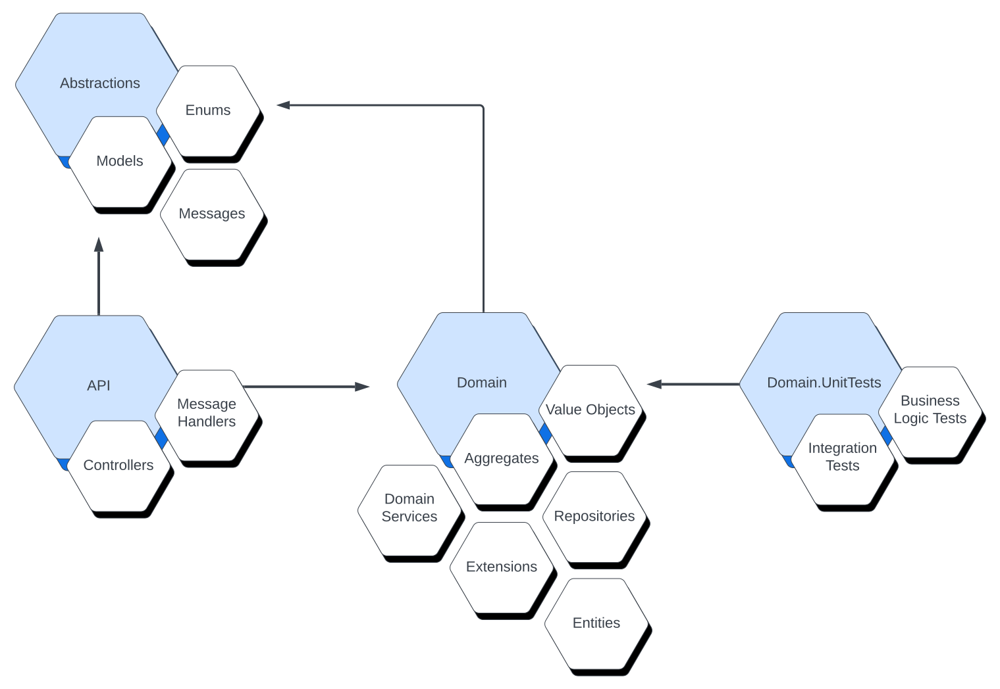

# Description
Domain-driven design is a methodology used to bring alignment between the business process and the functionality of the software that supports said business.

# Purpose
The main benefit is the consistency and terminology used by both the business and engineering teams when discussing the product. This allows for the software to match what the business does and help increase maintainability with the business desires to extend the functionality of the software platform to bring further parity with the business process

# Choosing this Pattern
Domain-driven design works best with more complex business domains that have a defined set of steps and logic that applies to each step. There is a level of overhead that comes with domain-driven design and it is designed for business contexts that have clearly defined boundaries and distinct process flows therein.

# Application Layers
The application architecture breaks into Abstractions, API, and Domain. Please visit the following sections for further details.
- [API](./API%20Layer.md)
- [Abstractions](./Abstractions.md)
- [Domain](./domain/Domain%20Layer.md)

## Dependencies 

